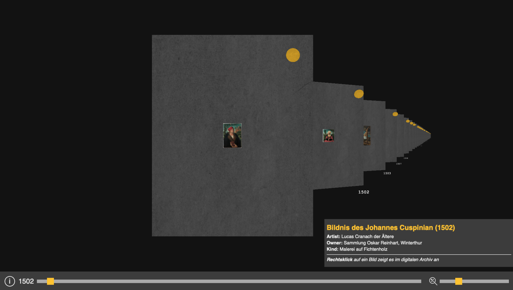

# Einleitung
Diese Ausarbeitung stellt die Prüfungsleistung des Moduls Beautiful Code dar. Es werden einzelne Aspekte aus der Vorlesung herausgearbeitet, kritisch betrachtet und mithilfe von praktischen Beispielen veranschaulicht. Alle Codebeispiele stammen aus einem Projekt, das im Modul Web Technologien entstanden ist. Diese Ausarbeitung ist in folgende Abschnitte gegliedert.

Zu Beginn wird das behandelte Projekt vorgestellt. Diese Vorstellung zeigt den Rahmen des Projekts auf, welche Funktionalitäten abgebildet werden und gibt Einblick über die Architektur und die verwendeten Technologien.

Im Weiteren werden Methoden und Muster behandelt, die zum Einsatz kommen. Diese werden auf ihre Vor- bzw. Nachteile oder mögliche Alternativen und Einschränkungen betrachtet und gegebenenfalls mittels Codebeispielen veranschaulicht.

Zum Schluss wird der Einfluss dieser Methoden und Muster auf das Projekt aufgearbeitet und in einem Fazit aggregiert.

# Projektvorstellung
Um in dieser Ausarbeitung auf Praxisbeispiele einzugehen, wird ein Projekt, welches im Rahmen des Moduls Web Technologien im Jahr 2022 entstanden ist als Anschauungsbeispiel genutzt. Im folgenden Kapitel werden die Rahmenbedingungen dieses Projekts erläutert.

## Projektkontext
Das Projekt beschäftigt sich in Teilen mit dem [Cranach Digital Archive (CDA)](https://lucascranach.org). Das CDA ist eine wissenschaftliche Quelle für historische Kunst von Lucas Cranach, seinen Söhnen und seiner Werkstatt. Dort ist es möglich, die digital ausgestellte Werke von Cranach auf verschiedene Arten, unterschiedliche Auflösungen und Aufnahmeverfahren, zu betrachten und Informationen über die Werke und Besitzer einzusehen.

Aus diesem Archive wurde ein großer Datensatz im JSON Format zur Verfügung gestellt. Diesen Daten lassen sich Kunstwerke, Referenzen auf Darstellungen dieser und Informationen wie Größe und Bezüge untereinander entnehmen.

## Projektziel
Die Ziele des Projekts wurden über ein Semester hinweg immer weiter definiert. Ein jeweils neues Ziel wurde mittels [GitHub Classroom als Issue](https://github.com/mi-classroom/mi-master-wt-beiboot-2022/issues) festgelegt, welches es dann zu erfüllen galt.

Das Finale Projekt sollte aus dem bereitgestellten Datensatz Informationen auslesen und diese im Web dreidimensional darstellten. Neben den Werken, die als **best of** gekennzeichnet sind, sollen Informationen zu diesen und Bezüge zu anderen Werken angezeigt werden.


Das Projekt ist im zugehörigen [GitHub Repo](https://github.com/mi-classroom/mi-web-technologien-beiboot-ss2022-JanKoll) einsehbar.

## Projektarchitektur & Technologien
Das Projekt basiert auf einer klassischen Client Serverarchitektur. Der Projektrahmen schreibt keine spezifische Technologie vor. Wie es zu den Technologieentscheidungen gekommen ist, wird in den angewandten Methoden näher erläutert.

Damit die Daten in ein geeignetes Format gebracht werden, kümmert sich die Serverkomponente darum, diese zu verarbeiten und mittels HTTP erreichbar zu machen. Die Laufzeitumgebung für den Server ist in [deno.land](https://deno.land) entwickelt. Deno hat eine eigene Paketverwaltung und stellt Entwickler:innen frei, ob sie mit JavaScript oder TypScript arbeiten möchten. Im Projekt kommt TypeScript zum Einsatz. Als Middleware für HTTP Datenübertragung wir die [cors](https://deno.land/x/cors@v1.2.2) Erweiterung eingesetzt.

Im Browser Frontend kommt [Vite](https://vitejs.dev) als Build Tool zum Einsatz, welches das Entwickeln und Ausführen der Anwendung mit praktischen [Funktionen](https://vitejs.dev/guide/features.html) unterstützt. Für die dreidimensionale Darstellung der Werke wird [Three.js](https://threejs.org) eingesetzt.  

# Angewandte Methoden & Muster
Das folgende Kapitel dokumentiert den Einsatz von Methoden und Mustern im vorher beschriebenen Projekt. Dabei wird im Laufe des Kapitels von weniger spezifischen Fällen wie Dokumentation, Review Prozess und Dateistruktur auf spezifische Fälle im Code eingegangen.

## Dokumentation
Das Projekt wurde nur durch einen Entwickler umgesetzt. Daher war eine umfangreiche Dokumentation nicht zwingend erforderlich. Um Entscheidungen trotzdem transparent zu machen, wurden Architectural Decision Records (ADR) verfasst, welche jede Technologieentscheidung widerspiegeln. Die ADRs sind in Markdown verfasst und beschreiben eine Entscheidung in folgendem Format:

```markdown
# Title

## Status
What is the status, such as proposed, accepted, rejected, deprecated, superseded, etc.?

## Context
What is the issue that we're seeing that is motivating this decision or change?

## Decision
What is the change that we're proposing and/or doing?

## Consequences
What becomes easier or more difficult to do because of this change?
```

Damit das Projekt auch durch Dritte ausgeführt werden kann, wurde es zusätzlich mittels Docker Containerisiert und eine Anleitung zum Ausführen in der `README.md` des Gits verfasst.

## Review Prozess
Teil des Projekts war es, dass Teams von zwei bis drei Entwickler:innen gebildet wurden, welche ihren Code gegenseitig reviewen. Dies sollte zu einer Steigerung der Code Qualität führen. Dafür wurde vor jedem Merge auf den Main Branch ein Pull Request erstellt, welche von den Teammitgliedern akzeptiert werden musste. Wenn Fehler gefunden oder andere Anmerkungen aufkamen, mussten diese erst gelöst werden. Dieser Prozess wurde in [diesem](https://github.com/mi-classroom/mi-web-technologien-beiboot-ss2022-JanKoll/blob/main/adr/XX-git.md) ADR festgehalten.

## Dateistruktur
Das Projekt besitzt folgende (vereinfachte) Dateistruktur:
```bash
.
├── 3d-client
│   ├── [...]
│   ├── Dockerfile
│   └── src
│       ├── [...]
│       ├── main.ts
│       └── utils
├── LICENSE
├── README.md
├── adr
│   ├── [...]
├── client
│   ├── [...]
├── docker-compose.yml
└── server
    ├── Dockerfile
    ├── data
    └── main.ts
```
Im Folgenden werden kurz die Ordner beschrieben, die Code für das Projekt enthalten.

Im `3d-client` Ordner befindet sich das Vite/Three.js Frontend. In der `main.ts` befindet sich der Großteil der Business Logic, welche durch häufig verwendete Funktionen aus dem `utils` Ordner ergänzt wird.

Der `server` Ordner enthält das Deno Backend. Diese liest ein JSON aus dem `data` Ordner aus.

> Der `client` Ordner ist ein Überüberbleibsel aus dem ersten Issue und kommt im Fertigen Projekt nicht mehr zum Einsatz. Er verweilt nur für die Bewertung durch den Betreuer des Projekts.

## Bennennung & Kommentare
Die Namen der Funktionen und Variablen sind in Englisch verfasst. Dies ist eine Konvention, die in der Softwareentwicklung weit verbreitet ist. Die Namen sind möglichst sprechend gewählt, um weitere Erklärung überflüssig zu machen. Bei einer Verkettung von Worten wird die *camelCase* Schreibweise angewandt.

Kommentare werden nur eingesetzt, um den Code in übersichtlichere Abschnitte zu unterteilten oder nicht offensichtliche Strukturen zu verdeutlichen, da diese bei Three.js ist oft undurchsichtig ist, wie zum Beispiel die Seitenreihenfolge bei einem Körper:

```typescript
let paintingMaterial = [
      [...]
      new THREE.MeshBasicMaterial({
        color: cubeColor // bottom
      }),
      new THREE.MeshBasicMaterial({
        map: loader.load(imgProxy) //front
      }),
      [...]
```

## Funktionen
Im Folgenden werden einzelne Funktionen betrachtet und näher auf die Designentscheidungen eingegangen.

### Physische Größe eines Werkes bestimmen
Eine Anforderung ist es, die Werke im Größenverhältnis zueinander abzubilden. Leider stellt der Datensatz dazu nicht zu allen bildern direkt Höhe x Breit in cm bereit. Ein Datensatz kann auch wie folgt aussehen:

```typescript
"dimensions": "Ma\u00dfe der bemalten Fl\u00e4che: 9,9 cm (Durchmesser)\nMa\u00dfe mit Rahmen: 13,5 (Durchmesser) x 1,7 cm (Tiefe)\n[Heydenreich, cda 2010]",
```

Damit die Größe trotzdem bestimmt werden kann, wurde eine serverseitig eine Funktion implementiert, welche die Höhe und Breite aus dem Datensatz extrahiert in einem geeigneten Format zurückliefert.

Es sind zwei Ausnahmefälle bekannt, die es abzufangen gilt:
1. Es wird nur Durchmesser und nicht die Kantenlängen übergeben, dann wird anhand der Pixelgröße, welche immer angegeben ist, das Seitenverhältnis bestimmt und mit diesen Informationen der Satz des Pythagoras angewendet, um die Kanten zu bestimmen.
2. Anstatt der Kantenlängen nur der Abstand des Bildes zum äußeren Rand des Rahmens übergeben. Zur Vereinfachung werden die Maße des Rahmens stattdessen verwendet.

```typescript
function parseInfoInNumbers(info : string, pxSize : any) {
    const regex = /[+-]?\d+(\,\d+)?/g;

    if (info.includes("Durchmesser")) {
        const cmDiameter = String(info).match(regex)!.map(function(v : string) { return Math.abs(parseFloat(v.replace(',', '.'))); }).slice(0, 1);
        const pxDiameter = Math.sqrt((Math.pow(pxSize.height, 2) + Math.pow(pxSize.width, 2)));
        const alpha = Math.asin(pxSize.height / pxDiameter);
        const cmHeight = cmDiameter[0] * Math.sin(alpha);
        const cmWidth = Math.sqrt((- Math.pow(cmHeight, 2) + Math.pow(cmDiameter[0], 2)));

        return returnInfo(`${String(cmHeight).replace('.', ',')} ${String(cmWidth).replace('.', ',')} cm`, pxSize);
    } else if (info.includes("Maße mit Rahmen:")) {
        return returnInfo(info.split('Maße mit Rahmen:')[1], pxSize);
    } else {
        return returnInfo(info, pxSize);
    }
}
```
> Die `returnInfo()` Funktion wandelt maße in ein geeignetes Format für den Client.


### Vereinfachen von `fetchImages()`
Die folgende Funktion für den Client dient dazu, die Werke vom Deno Server zu fetchen. Der Aufruf erfolgt inital beim Start des Clients um alle *best of* Werke zu laden, aber auch jedes Mal, wenn Referenzen abgefragt werden. 

Es ist möglich, Suchparameter an die Funktion zu übergeben, um Referenzwerke zu fetchen, das vermeidet eine Codedopplung. Der folgende Code Ausschnitt zeigt, wie die Funktion vereinfacht wurde (alter Aufruf ist auskommentiert). Es wurde außerdem eine Fehlermeldung über die Catchfunktion ergänzt, sollte der Server nicht erreichbar sein.

```typescript
export async function fetchImages(search: string = '') {
  // if (search === '') {
  //   const response = await fetch(CONFIG.fetchURL, {
  //     mode: 'cors',
  //     method: 'GET'
  //   });

  //   const data = await response.json()
  
  //   return data;
  // } else {
  //   const response = await fetch(CONFIG.searchURL + search, {
  //     mode: 'cors',
  //     method: 'GET'
  //   });

  //   const data = await response.json();
  
  //   return data;
  // }

  let url = CONFIG.fetchURL;

  if (search !== '')
    url = CONFIG.searchURL + search;

  const response = await fetch(url, {mode: 'cors', method: 'GET'})
    .catch((error) => {console.error(error)});

  return await response.json();
}
```

### Sechs Parameter bei `generatePlane()` 
Die folgende Funktion benötigt bei einem Aufruf mindestens vier Parameter, kann aber auch bis zu sechs übergeben bekommen.

```typescript
function generatePlane(image : any, positionX : number, positionY : number, positionZ : number, timeBeam : boolean = true, destroyable : boolean = false) {[...]}
```

Durch den Aufruf werden im Raum die Kunstwerke Werke von generiert, daher ist der erste Parameter das Werk selbst, die nächsten Drei bestimmen die Postion. Die Positionen könnten auch als ein Objekt übergeben werden, was den Zugriff und die Eindeutigkeit in der Funktion selbst allerdings verschleiern würde, da dort auch Positionen eines Objektes verändert werden.

Die letzten beiden Parameter dienen dazu, Codedopplungen zu vermeiden, da diese Funktion initial alle anzuzeigenden Werke, aber auch im weiteren Programmablauf noch weitere Werke, die Referenzen, generiert. Dazu muss der Funktion bekannt sein, ob Jahreszahlen mit erzeugt werden sollen und ob das Objekt nach Erstellung zerstörbar seinen soll.

## Abstraktion und Modularisierung
Damit ein Projekt gut wartbar ist, sollten einzelne Komponenten gut modularisiert werden. Dazu bietet sich für eine Webanwendung das MVC-Pattern an, welches Kernfunktionalitäten aufteilt und unabhängig(er) von Ausfällen einzelner Komponenten macht. Das ist im behandelten Beispiel **nicht** der Fall. Model, View und Controller haben keine strickte Trennung der Verantwortlichkeiten. Es werden beispielsweise nach dem Initialen Fetch von Date, diese gleich in den View gerendert und kein Error Handling bei nicht erreichen der API / des Servers vorgenommen.

Das Problem lässt sich lösen, wenn die Verantwortlichkeiten der Anwendung adressiert und modularisiert werden. Dafür sollte ein Controller sich erst um die Beschaffung der Daten kümmern (eine Formatierung oder Selektion ist nicht nötig, da dies bereits serverseitig passiert). Nach Beschaffung der Daten können diese vom Controller an den View übergeben werden, welcher sich um die Darstellung kümmert.

Im Projekt ist die Funktionalität grundsätzlich gegeben, es ist für eine korrekte Implementierung notwendig, die bereits segmentierten Bereiche besser zu strukturieren, um sie dann zu modularisieren und mit einem Error Handling anzureichern. Somit könnte das Projekt stabilerer und wartbarer werden.

# Fazit und Ausblick
Das Schreiben von Code ist ein Prozess. Es sollte nicht der Anspruch von Entwickelnden sein, fehlerfreien und schönen Code auf Anhieb zu produzieren. Es sollte möglich sein sich auszuprobieren, ohne dass ein Stück Code gleich, wenn auch nur in den eigenen Augen, als schlecht abgestempelt wird. Durch ständiges Refactoring ist es möglich, die Qualität stets zu steigern und selbst etwas daraus mitzunehmen.

Während der Entwicklung dieses Projekts wurden zwar Reviews vorgenommen, allerdings im herkömmlichen Sinne kein Refactoring. Jede Funktionalität, die funktioniert, ist gut. Das ist vor allem der Projektgröße (ein Entwickler) zuzuschreiben. In größeren Projekten wäre ein nachträgliches Refactoring ein großer Kostenfaktor und sollte daher während der Produktion stattfinden. Bei dieser Projektgröße jedoch ist es auch mit wenig Zeitaufwand möglich, die Qualität zu steigern.

Einige besprochenen Methoden aus der Beautiful Code Vorlesung lassen sich gut auf das behandelte Projekt übertragen. Die Benennung von Funktionen und Variablen oder die Aufteilung/Abstraktion nach Zuständigkeiten sind Beispiele für eine sinnvolle Einbindung in das Projekt. Schwieriger hingegen ist es, verschiedene Entwurfsmuster oder syntaktische sprachenspezifische Tipps anzuwenden, da diese vor allem in der objektorientierten Programmierung Anwendung finden. Die vorstellten Muster könnten sich aber (zumindest teilweise) auf funktionale Programmierung abbilden lassen.

Code der Beautiful ist lässt sich einfacher Warten, was Zeit und Kosten sparen kann. Durch die dadurch erzeugte Klarheit wird der Code höchstwahrscheinlich stabiler und hochwertiger. Das Anwenden von bestimmten Konventionen oder Mustern muss allerdings keine Garantie sein, dass eine Steigerung der Qualität stattfindet, dafür müssen diese Methoden gut abgestimmt werden und früh im Projekt angewandt werden.

Insgesamt ist es zu empfehlen, sich über frühzeitig Gedanken über bestimmte Konventionen, Methoden und das Refactoring zu machen. Das Verwenden von in der Praxis bewährten Mustern kann ein Projekt während der Entwicklung unterstützen und mit dazu beitragen, ein noch besseres Bewusstsein für guten Code zu erlangen.